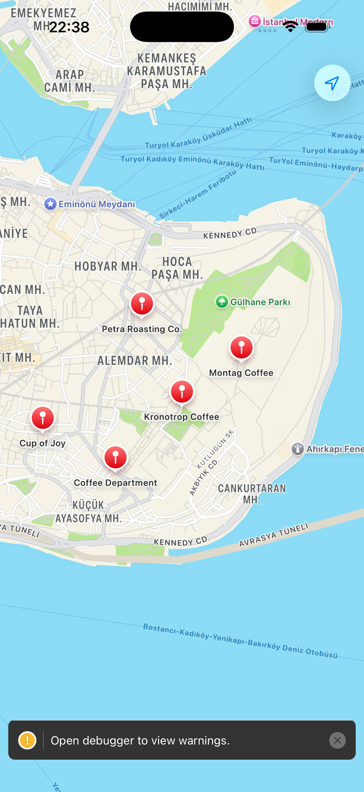
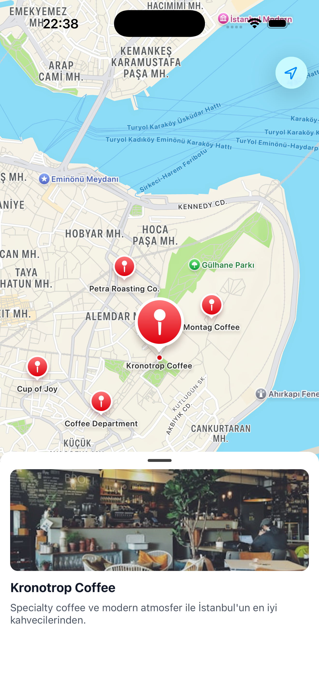
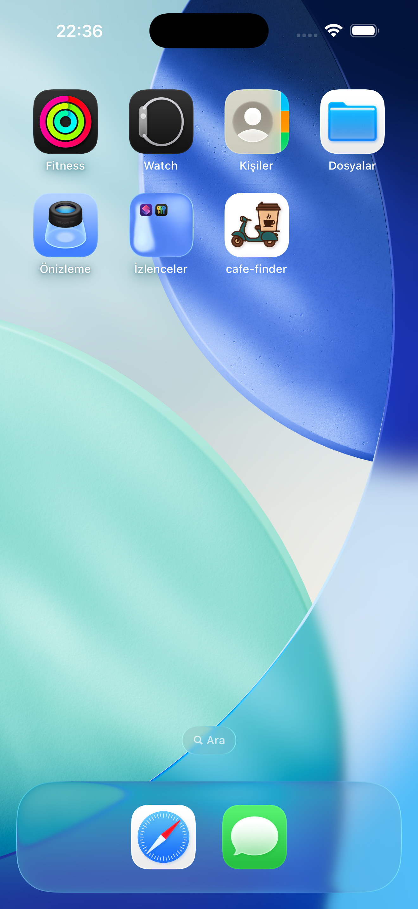
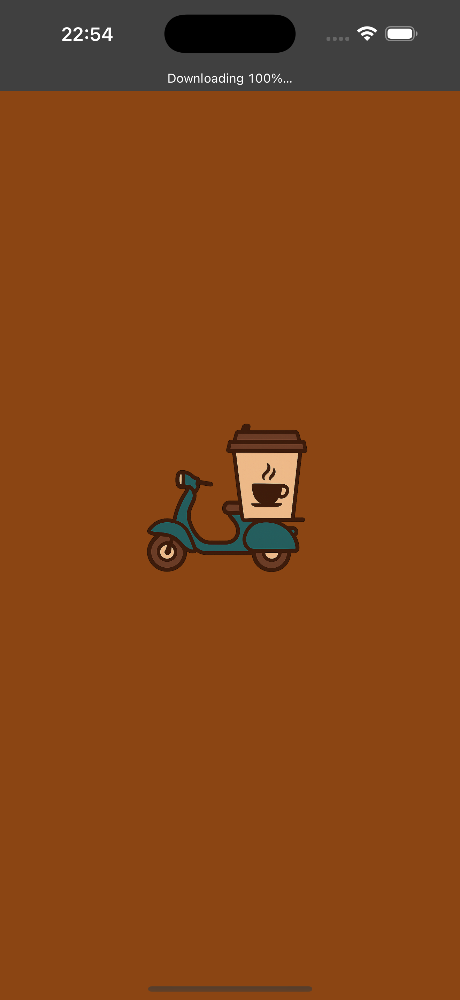

# Cafe Finder

Harita tabanli bir cafe kesif uygulamasi.

## Teknolojiler

- Expo
- TypeScript  
- Nativewind (Tailwind CSS)
- Expo Maps (Apple Maps)
- Gorhom Bottom Sheet

## Ozellikler

- Harita uzerinde cafe lokasyonlari
- Markera tiklaninca bottom sheet acilmasi
- Cafe gorseli, adi ve aciklamasi
- Ozel app icon ve splash screen

## Cafe Listesi JSON Ornegi

[
  {
    "id": "1",
    "name": "Kronotrop Coffee",
    "description": "Specialty coffee ve modern atmosfer",
    "coordinate": { "latitude": 41.0082, "longitude": 28.9784 },
    "image": "https://images.unsplash.com/photo-1554118811-1e0d58224f24?w=400"
  },
  {
    "id": "2", 
    "name": "Petra Roasting Co.",
    "description": "Kendi kavurdugu kahveler",
    "coordinate": { "latitude": 41.0122, "longitude": 28.9760 },
    "image": "https://images.unsplash.com/photo-1495474472287-4d71bcdd2085?w=400"
  },
  {
    "id": "3",
    "name": "Coffee Department",
    "description": "Genis menusu ile calisma icin ideal",
    "coordinate": { "latitude": 41.0052, "longitude": 28.9744 },
    "image": "https://images.unsplash.com/photo-1453614512568-c4024d13c247?w=400"
  },
  {
    "id": "4",
    "name": "Montag Coffee",
    "description": "Sakin atmosferi ve kaliteli kahvesi",
    "coordinate": { "latitude": 41.0102, "longitude": 28.9820 },
    "image": "https://images.unsplash.com/photo-1511081692775-05d0f180a065?w=400"
  },
  {
    "id": "5",
    "name": "Cup of Joy",
    "description": "Tatlilari ve sicak ortamiyla",
    "coordinate": { "latitude": 41.0070, "longitude": 28.9700 },
    "image": "https://images.unsplash.com/photo-1559496417-e7f25cb247f3?w=400"
  }
]

## Development Build

iOS icin:

npm i

npx expo run:ios

Android icin:

npm i

npx expo run:android

## Ekran Goruntuleri

### Harita Ekrani

### Bottom Sheet Ekranı

### Icon Ekranı

### Splash Ekranı

## Gelistirici

Emre
